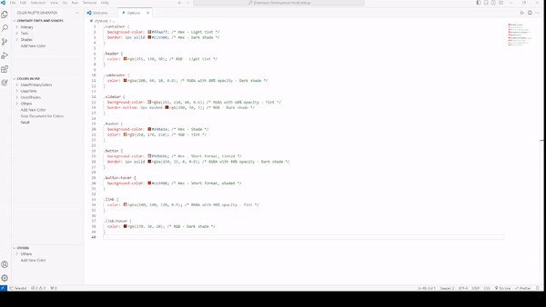

# Color Palette Generator README

Welcome to the `Color Palette Generator` extension for VS Code. This extension provides a comprehensive color palette manager, designed to streamline and enhance your design and development workflow in Visual Studio Code.

## Features

Explore the powerful features of `Color Palette Generator`:

- **Automatic Tints and Shades Generation**: Enter a primary color and automatically generate 15 tints and 15 shades.

- **Automatic retrieves all colors used in your code and divides them in Tints and Shades**: Insert your project's primary color and Color Palette Generator will do the rest.

- **Click and copy to get color hex value**: Click on any color and you will copy the color's hex code in no time.

## Requirements

`Color Palette Generator` runs seamlessly with no additional requirements. However, if future versions incorporate dependencies, they will be listed in this section.

## Extension Settings

`Color Palette Generator` integrates the following settings for a tailored user experience:

- `Color Palette Generator.enable`: Toggle the extension on/off.

## Known Issues

Any identified issues or potential bugs will be listed here to keep users informed.

## Release Notes

Stay updated with the improvements and fixes made to `Color Palette Generator`:

### 0.0.1

- Initial release of `Color Palette Generator`.

### 0.0.3

- Resolved issue : same color added twice lead to displaying error.

**Enjoy using `Color Palette Generator`!**
